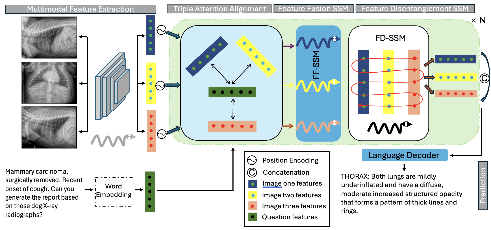
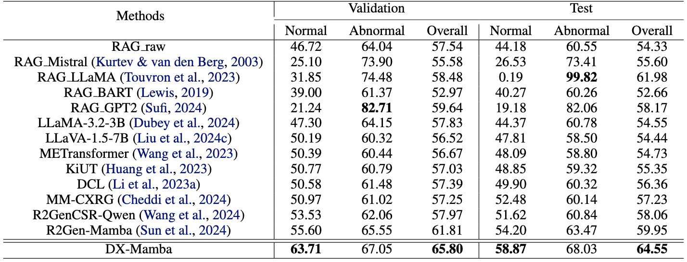
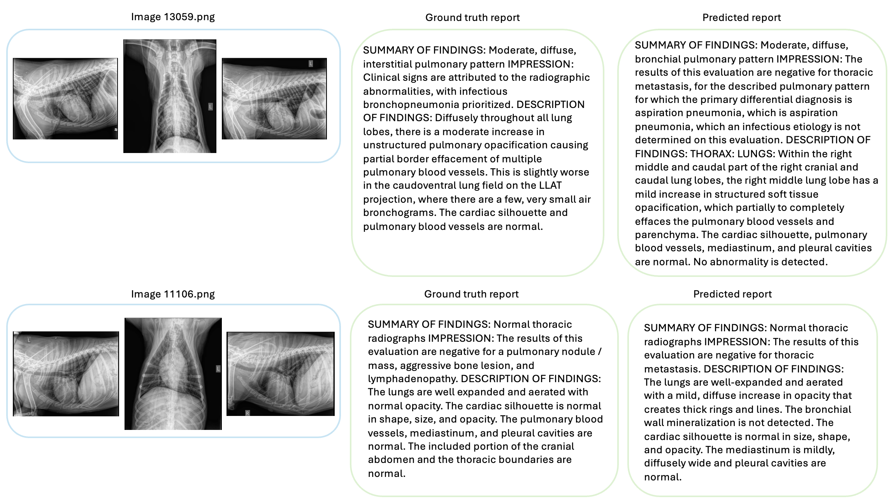
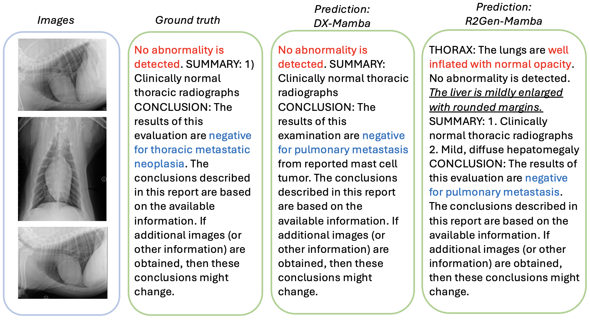

<html lang="en">
<head>
    <meta charset="UTF-8">
    <meta name="viewport" content="width=device-width, initial-scale=1.0">
    <title>Font Example</title>
    <!-- Google Fonts link -->
    <link href="https://fonts.googleapis.com/css2?family=Roboto:wght@400;700&display=swap" rel="stylesheet">
    
</head>

<body>
    <header>
        <h1 style="text-align: center;">DX-Mamba: Exploring State Space Model for Dog X-ray Report Generation</h1>
    </header>
    <nav>
        <a href="#abstract">Abstract</a>
        <a href="#theme">DX-Mamba and state space model (SSM)</a>
        <a href="#results">Results</a>
    </nav>

    

        <!-- Clickable image tab -->
        
    

    
    <main>
        <section id="abstract">
            <h2 style="text-align: center;">Abstract</h2>
            
Thoracic diseases are common causes of canine deaths. Automatic medical imaging report generation aims to generate accurate and coherent reports for medical images to save manual labor for clinicians. Research in the past decade showed that deep learning approaches could achieve promising performance in assisting disease diagnoses with medical image interpretation in the medical field. However, the deep learning application for report generation in the veterinary field is limited. Also, deep learning models require a more comprehensive structure and a large amount of data for training to improve their diagnostic efficiency and accuracy in report generation. Therefore, in this paper, we first develop a large-scale dog thoracic X-ray images dataset, Dog-Xray, with 13,794 subject studies and 36,264 thoracic X-ray images between 2008 and 2024. We then propose a novel DX-Mamba model that combines a Mamba vision model for multimodal feature extraction, a triple attention alignment for multi-imaging and text feature alignment, a feature fusion state space model (FF-SSM) and a feature disentanglement state space model (FD-SSM) for comprehensive feature learning and disentanglement, and a prediction module for report generation. We also propose a novel report inter-class loss and an intra-class loss to ensure the compactness of similar report content within and among reports, for better report generation performance. Extensive experiment results show that our DX-Mamba model achieves state-of-the-art performance in the report generation task.

        </section>
        <section id="theme">
            <h2 style="text-align: center;">DX-Mamba and state space model (SSM) for report generation</h2>
            <figure style="display: flex; flex-direction: column; align-items: center; justify-content: center; text-align: center;">
                
                <figcaption style="margin-top: 10px; font-style: italic; color: #555; text-align: center;">Figure 1: Workflow of the proposed DX-Mamba model</figcaption>
            </figure>
            
Automatic report generation for medical images aims to produce several descriptive sentences about medical images. Encoder-decoder architectures and retrieval augmented generation (RAG) methods have been applied to the automatic report generation task. However, the transformer-based methods as well as RAG are computationally expensive. In 2023, the Mamba model, leveraging the efficiency of selective state space models in compressing necessary information in smaller states, was proposed to address the computational inefficiency of transformers and local perception limitations of CNNs. In this research, we aim to use the powerful vision Mamba structure as the backbone and SSMs for feature fusion and disentanglement for the automatic report generation task. This page provides an overview of our proposed method. 
            
   
                <h3>Model architectures</h3>
                
The DX-Mamba model leverages the vision Mamba backbone, with newly proposed triple attention alignment (TAA), and feature fusion and disentanglement state space models (FF-SSM and FD-SSM), and a language transformer decoder. Combining these structures enables our DX-Mamba model to better align the image and text features for better report generation performance. We also propose a large-scale report generation dataset containing dog thoracic X-ray images and reports. 

                    <ul>
                        <li><b>Triple attention alignment (TAA):</b>  This TAA architecture ensures the alignment of text and image features in an image pair and extracts the shared information from both text and image features. </li>
                        <li><b>Feature fusion and disentanglement SSMs:</b>  These SSMs help with complementary image and text feature learning and disentanglement.</li> 
                        <li><b>Report intra-class and inter-class losses:</b>  These two losses aim to compact reports with similar contents, i.e., reports with similar contents in the same class, and part those with different classes.</li> 
                    </ul>
        </section>
        <section id="results">
            <h2 style="text-align: center;">Results</h2>
            
To evaluate the performance of our proposed DX-Mamba model, we collected a large-scale dog x-ray dataset, named Dog-Xray. With extensive experiments, we show that our DX-Mamba model can be applied as an effective report-generation model, in both the veterinary and human medical fields.

                <h3>Dataset</h3>
                
We develop the first large-scale dog thoracic X-ray dataset, Dog-Xray, mainly to deal with the lack of training data for deep learning models, facilitating the report generation task in the veterinary field. The dataset is unique as it is the first large-scale dataset focusing on dogs. It contains 13,794 dog thoracic studies and 36,264 corresponding X-ray images. The detailed information of the split train, validation, and test datasets is shown in Table 1.
                
We have uploaded our dataset on [Hugging Face](https://huggingface.co/datasets/Anonymousab/Dog-Xray). However, due to dataset privacy, we enable a brief request before you can preview or download the dataset. Please provide your name, institution, and a brief explanation of how you intend to use the data to our [Email](anonymous_ab6@hotmail.com), alongside the automatic verification process ON THE WEBSITE. We will grant access instantly when we receive the information. 

                <figure style="display: flex; flex-direction: column; align-items: center; justify-content: center; text-align: center;">
                    
                    <figcaption style="margin-top: 10px; font-style: italic; color: #555; text-align: center;">Table 1: An overview of the Dog-Xray dataset.</figcaption>
                </figure>   
                
                <h3>Experiment results</h3>
                
                <figure style="display: flex; flex-direction: column; align-items: center; justify-content: center; text-align: center;">
                    
                    <figcaption style="margin-top: 10px; font-style: italic; color: #555; text-align: center;">Table 2: Results comparisons of different methods on the Dog-Xray validation dataset.</figcaption>
                </figure>    

                <figure style="display: flex; flex-direction: column; align-items: center; justify-content: center; text-align: center;">
                    
                    <figcaption style="margin-top: 10px; font-style: italic; color: #555; text-align: center;">Table 3: Results comparisons of different methods on the Dog-Xray test dataset.</figcaption>
                </figure>    

                <figure style="display: flex; flex-direction: column; align-items: center; justify-content: center; text-align: center;">
                    
                    <figcaption style="margin-top: 10px; font-style: italic; color: #555; text-align: center;">Table 4: Results comparisons (× 100) of accuracy using different methods on the Dog X-ray dataset on the validation and test sets.</figcaption>
                </figure>      
                
                <figure style="display: flex; flex-direction: column; align-items: center; justify-content: center; text-align: center;">
                    
                    <figcaption style="margin-top: 10px; font-style: italic; color: #555; text-align: center;">Table 5: Results comparisons of different methods on the IU-Xray and MIMIC-CXR datasets.</figcaption>
                </figure>           
                
                
We evaluate our DX-Mamba model using BLEU, METEOR,  ROUGE-L, and CIDEr. We compared our model with state-of-the-art report generation models, vision-language models, and retrieval augmented-generation (RAG) methods on our Dog-Xray dataset and the widely-used benchmark human lung IU-Xray and MIMIC-CXR datasets for the report generation performance. Figure 2 and Figure 3 display predicted reports from 3 sample image pairs. As shown in Table 2 and Table 3, our proposed DX-Mamba model outperforms state-of-the-art models on all metrics in the automatic report generation task using the Dog-Xray dataset. In particular, we can see great improvements in BLEU and CIDEr scores. We evaluate the clinical correctness of predicted reports using different methods. Table 4 shows that the DX-Mamba model achieves better overall accuracy in generating either normal or abnormal reports. We also compared the performance of DX-Mamba with state-of-the-art models using the benchmark datasets, IU-Xray and MIMIC-CXR. As shown in Table 5, compared to models initially trained with human medical datasets, instead of veterinary datasets, our model also displayed promising performance on the report generation task, achieving the highest score across all metrics.

                <figure style="display: flex; flex-direction: column; align-items: center; justify-content: center; text-align: center;">
                    
                    <figcaption style="margin-top: 10px; font-style: italic; color: #555; text-align: center;">Figure 2: Predicted report samples on image pairs 13059 and 11106 using the DX-Mamba
model.</figcaption>
                </figure>  
                
                <figure style="display: flex; flex-direction: column; align-items: center; justify-content: center; text-align: center;">
                    
                    <figcaption style="margin-top: 10px; font-style: italic; color: #555; text-align: center;">Figure 3: Abnormal report prediction: study 13115 (lung abnormality). </figcaption>
                </figure>
                

                
To better demonstrate the effectiveness of our DX-Mamba model, we include a sample study and predictions for the qualitative analysis. We include predictions using the DX-Mamba model and the R2Gen-Mamba model. We can see from Figure 4 that the prediction of our DX-Mamba model is highly similar to the sample ground truth, regarding both phrasing and semantic similarity. The key parts of the reports highlighted in red "No abnormality is detected." and blue "...negative for thoracic metastatic neoplasia" indicate that both models can capture the semantic meanings of the image pair and the ground truth report, while the R2Gen-Mamba model predicts additional information not relevant to the original report, which is displayed in the underlined italic font.

                <figure style="display: flex; flex-direction: column; align-items: center; justify-content: center; text-align: center;">
                    
                    <figcaption style="margin-top: 10px; font-style: italic; color: #555; text-align: center;">Figure 4: Predicted reports comparison on a sample image pair 12088 using DX-Mamba and R2Gen-Mamba models.</figcaption>
                </figure>                    
                <h3>Benefits in the medical field</h3>
                     <ul>
                        <li><b>More accurate prediction:</b> Including the novel SSMs and losses in our DX-Mamba model enables our model to perform better at predicting more semantically similar and accurate reports that reflect the information from x-ray images. </li>
                        <li><b> Scalability to other fields:</b> Our extensive experiment results show that our model can be applied to the human medical field in addition to the veterinary field.  </li>
                     </ul>
                <h3>Future direction</h3>
                
In the future, we plan to modify our model to make it a fully Mamba-based model, further leveraging the superior capacity of Vision Mamba on text and image feature learning and processing.

                
Please contact ... for more information about the Dog-Xray dataset.
            
    <footer>
        
&copy; 2024 Anonymous-ab. All rights reserved.

    </footer>

