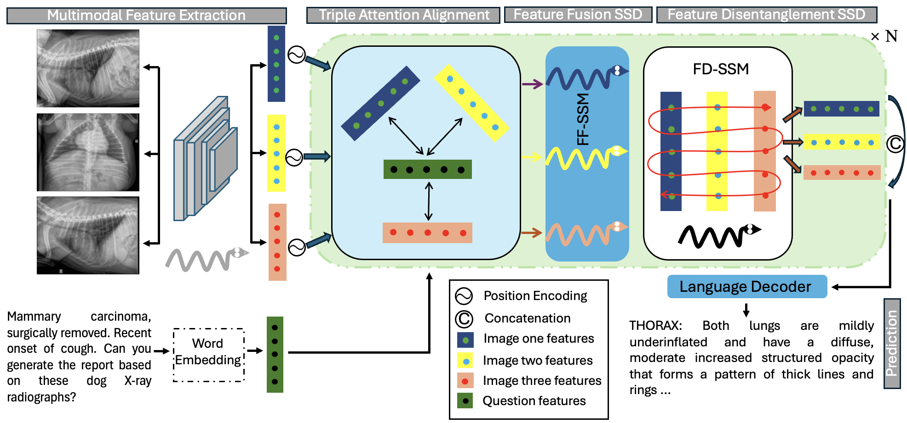

<html lang="en">
<head>
    <meta charset="UTF-8">
    <meta name="viewport" content="width=device-width, initial-scale=1.0">
    <title>Font Example</title>
    <!-- Google Fonts link -->
    <link href="https://fonts.googleapis.com/css2?family=Roboto:wght@400;700&display=swap" rel="stylesheet">
    
</head>

<body>
    

    <header>
        <h1 style="text-align: center;">DX-Mamba: Exploring State Space Model for Dog X-ray Report Generation</h1>
    </header>
    <nav>
        <a href="#abstract">Abstract</a>
        <a href="#theme">DX-Mamba and state space model (SSM)</a>
        <a href="#overview">Overview</a>
    </nav>
    <main>
        <section id="abstract">
            <h2 style="text-align: center;">Abstract</h2>
            
Thoracic diseases are common causes of canine deaths. Automatic medical imaging report generation aims to generate accurate and coherent reports for medical images to save manual labor for clinicians. Research in the past decade showed that deep learning approaches could achieve promising performance in assisting disease diagnoses with medical image interpretation in the medical field. However, the deep learning application for report generation in the veterinary field is limited. Also, deep learning models require a more comprehensive structure and a large amount of data for training to improve their diagnostic efficiency and accuracy in report generation. Therefore, in this paper, we first develop a large-scale dog thoracic X-ray images dataset, Dog-Xray, with 13,794 subject studies and 36,264 thoracic X-ray images between 2008 and 2024. We then propose a novel DX-Mamba model that combines a Mamba vision model for multimodal feature extraction, a triple attention alignment for multi-imaging and text feature alignment, a feature fusion state space model (FF-SSM) and a feature disentanglement state space model (FD-SSM) for comprehensive feature learning and disentanglement, and a prediction module for report generation. We also propose a novel report inter-class loss and an intra-class loss to ensure the compactness of similar report content within and among reports, for better report generation performance. Extensive experiment results show that our DX-Mamba model achieves state-of-the-art performance in the report generation task.

        </section>
        <section id="theme">
            <h2 style="text-align: center;">DX-Mamba and state space model (SSM) for report generation</h2>
            <figure style="display: flex; flex-direction: column; align-items: center; justify-content: center; text-align: center;">
                
                <figcaption style="margin-top: 10px; font-style: italic; color: #555; text-align: center;">Figure 1: Workflow of the proposed DX-Mamba model</figcaption>
            </figure>
            
Automatic report generation for medical images aims to produce several descriptive sentences about medical images. Encoder-decoder architectures and retrieval augmented generation (RAG) methods have been applied to the automatic report generation task. However, the transformer-based methods as well as RAG are computationally expensive. In 2023, the Mamba model, leveraging the efficiency of selective state space models in compressing necessary information in smaller states, was proposed to address the computational inefficiency of transformers and local perception limitations of CNNs. In this research, we aim to use the powerful vision Mamba structure as the backbone and SSMs for feature fusion and disentanglement for the automatic report generation task. This page provides an overview of our proposed method. With extensive experiments, we show that our DX-Mamba model can be applied as an effective report generation model.  
             

        </section>
        <section id="overview">
            <h2 style="text-align: center;">Overview</h2>
            
The DX-Mamba model leverages the vision Mamba backbone, with newly proposed triple attention alignment (TAA), and feature fusion and disentanglement state space models (FF-SSM and FD-SSM), and a language transformer decoder. Combining these structures enables our DX-Mamba model to better align the image and text features for better report generation performance. We also propose a large-scale report generation dataset containing dog thoracic X-ray images and reports. 
                <h3>Dataset</h3>
                
We develop the first large-scale dog thoracic X-ray dataset, Dog-Xray, mainly to deal with the lack of training data for deep learning models facilitating the report generation task in the veterinary field. The dataset is unique as it is the first large-scale dataset focusing on dogs. It contains 13,794 dog thoracic studies and 36,264 corresponding X-ray images.
                <\p>
                <h3>Model architectures</h3>
                    <ul>
                        <li><b>Triple attention alignment (TAA):</b>  This TAA architecture ensures the alignment of text and image features in an image pair and extracts the shared information from both text and image features. </li>
                        <li><b>Feature fusion and disentanglement SSMs:</b>  These SSMs help with complementary image and text feature learning and disentanglement.</li> 
                        <li><b>Report intra-class and inter-class losses:</b>  These two losses aim to compact reports with similar contents, i.e., reports with similar contents in the same class, and part those with different classes.</li> 
                    </ul>
                <h3>Benefits in the medical field</h3>
                     <ul>
                        <li><b>More accurate prediction:</b> Including the novel SSMs and losses in our DX-Mamba model enables our model to perform better at predicting more semantically similar and accurate reports that reflect the information from x-ray images. </li>
                        <li><b> Scalability to other fields:</b> Our extensive experiment results show that our model can be applied to the human medical field in addition to the veterinary field.  </li> 
                <h3>Current challenge </h3>
                <h3>Future direction</h3>
            
    <footer>
        
&copy; 2024 Anonymous-ab. All rights reserved.

    </footer>

